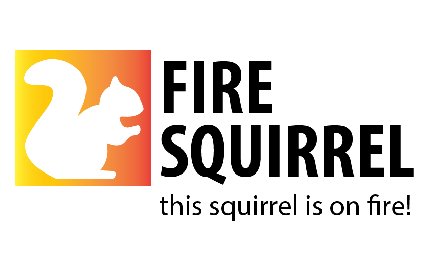
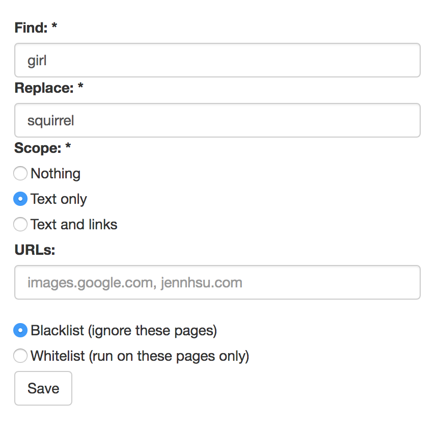
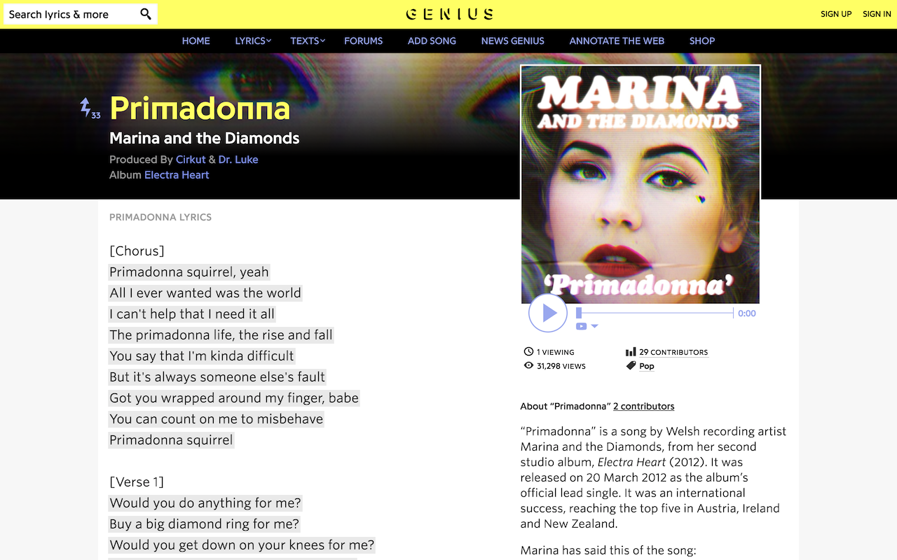
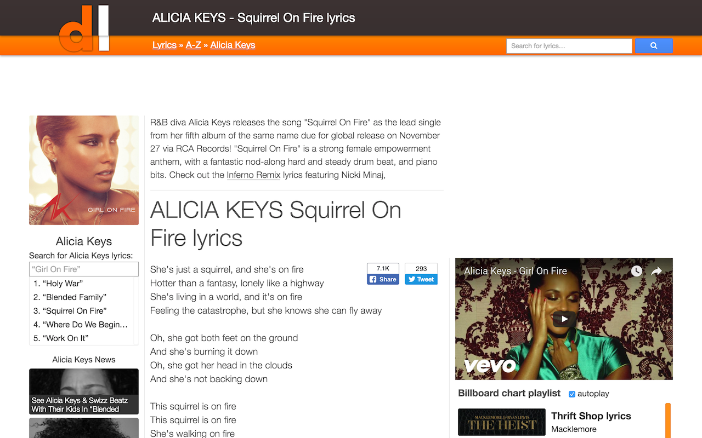
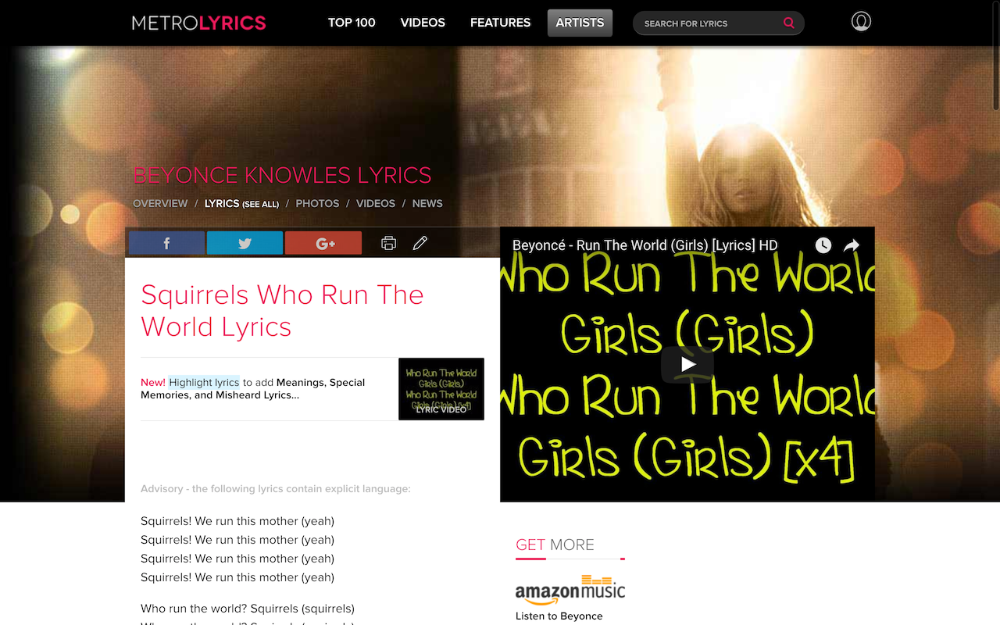

# This squirrel is on fire!
## A word replacing extension for Google Chrome

Defaults to replacing the word "girl" with "squirrel". You can pick your own words (or even emojis) on the options page.

Test it out by searching for the following song lyrics:
Primadonna Girl - Marina and the Diamonds
Run The World (Girls) - Beyoncé
Girl On Fire - Alicia Keys

Matches capitalization found on page

## Chrome Store

Available on Chrome Store [here](https://chrome.google.com/webstore/detail/this-squirrel-is-on-fire/hbkgdoeflcloeepeihpdekknnnedplom)

## Sample screenshots:

